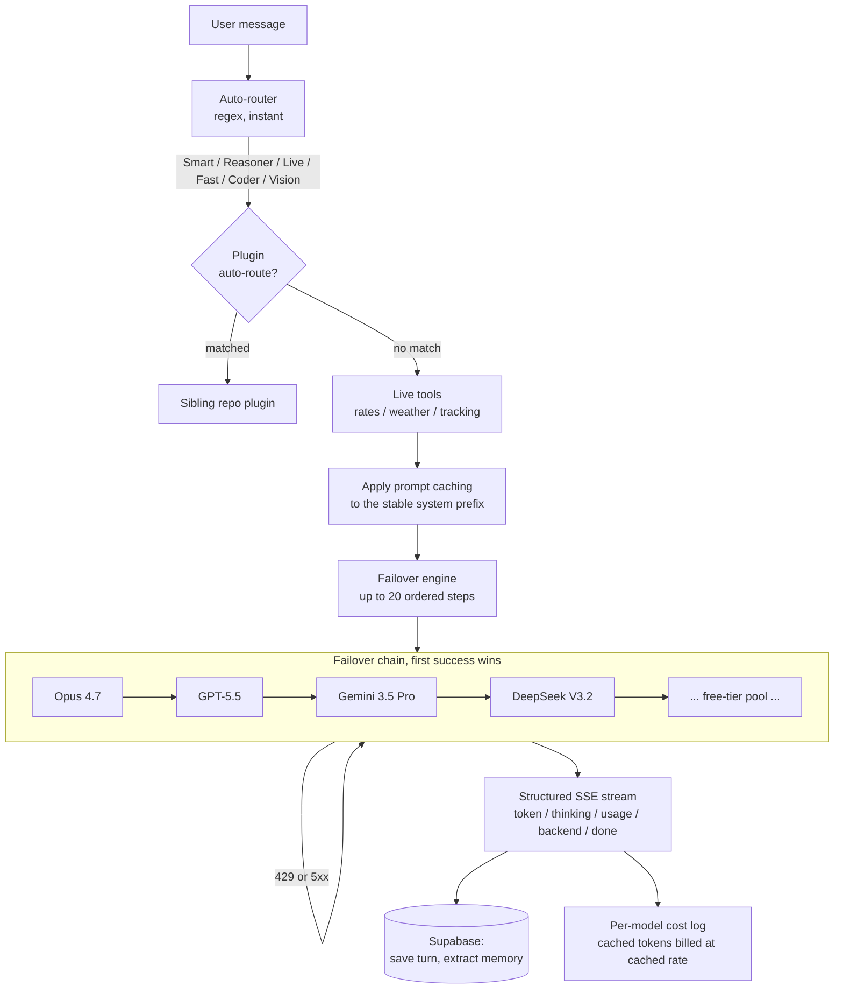

# SarmaLink-AI

**A self-hosted, multi-provider LLM gateway that chains ten chat providers behind one endpoint so your users never see a rate-limit error.**

SarmaLink-AI is a headless Next.js backend that routes every message through an ordered failover of AI engines, falling to the next in under 50 milliseconds on any rate-limit or error. It speaks the OpenAI chat-completions contract, caches the stable prompt prefix across every provider that supports it, streams a typed event protocol, passes tool calls through to Model Context Protocol servers, and tracks per-model cost. Bring your own keys, deploy on Vercel or any Next.js host, and pay only what the providers charge.

[](https://github.com/sarmakska/Sarmalink-ai/actions/workflows/ci.yml)
[](https://github.com/sarmakska/Sarmalink-ai/blob/main/LICENSE)
[](https://github.com/sarmakska/Sarmalink-ai)
[](https://github.com/sarmakska/Sarmalink-ai/commits/main)
[](https://nextjs.org)
[](https://typescriptlang.org)
[](https://supabase.com)
[](https://tailwindcss.com)
[](https://cloudflare.com)
[](https://vercel.com)
[](https://github.com/sarmakska/sarmalink-ai)

[](#architecture)
[](#powered-by-ten-providers)
[](#the-six-modes)
[](#the-six-modes)
[](#the-six-modes)

## Star History

<a href="https://www.star-history.com/#sarmakska/Sarmalink-ai&Date">
 <picture>
   <source media="(prefers-color-scheme: dark)" srcset="https://api.star-history.com/svg?repos=sarmakska/Sarmalink-ai&type=Date&theme=dark" />
   <source media="(prefers-color-scheme: light)" srcset="https://api.star-history.com/svg?repos=sarmakska/Sarmalink-ai&type=Date" />
   
 </picture>
</a>

**An open-source, multi-provider AI backend with automatic failover.**

Built by [Sarma Linux](https://sarmalinux.com), 17 months of development, open-sourced for everyone.

> **v1.3.0 shipped on 2026-05-31.** Frontier adapters for Opus 4.7, GPT-5.5 and Gemini 3.5 Pro, cross-provider prompt caching, a typed structured-streaming protocol, MCP tool-call passthrough, and per-model cost dashboards. 151 tests green. See [CHANGELOG.md](CHANGELOG.md) for the full list and [docs/OPEN-ISSUES.md](docs/OPEN-ISSUES.md) for what is open for contributors.

> **What this repo is:** a headless Next.js **backend**, the failover engine, auto-router, live tools, Supabase schema, and REST/SSE API (`/api/ai-chat`). It is **not** a drop-in ChatGPT clone UI. If you want the full hosted product with dark mode, markdown rendering, and thinking traces, see [sarmalinux.com/products/sarmalink-ai](https://sarmalinux.com/products/sarmalink-ai). To build your own UI on top, point any chat client at the SSE endpoint, see [docs/HOW-IT-WORKS.md](docs/HOW-IT-WORKS.md) for the streaming protocol.

---

## What is SarmaLink-AI?

SarmaLink-AI is a production-ready LLM gateway that routes every message through a **failover** of AI engines. If one engine is busy, the next fires in under 50 milliseconds. Users never see errors; they always get an answer.

- **74 engine entries across ten chat providers** (Anthropic, OpenAI via GitHub Models, Google Gemini, Groq, SambaNova, Cerebras, OpenRouter, Cohere, Mistral, Ollama), with up to a 20-step failover in Smart mode
- **May-2026 frontier models** at the head of the chain when you supply premium keys: Opus 4.7, GPT-5.5 and Gemini 3.5 Pro. Leave them unset and the gateway runs entirely on free tiers
- **Cross-provider prompt caching** that marks the stable system prefix as cacheable so re-reads bill at the provider's cached rate
- **Structured streaming** over a typed, forwards-compatible SSE event protocol (`token`, `thinking`, `usage`, `backend`, `done` and more)
- **MCP tool-call passthrough** to any Model Context Protocol server over JSON-RPC
- **Per-model cost dashboards** in the admin health endpoint, billing cached tokens at the cached rate
- **Smart auto-routing** that detects code, web search, quick answers or deep reasoning and picks the right mode with no extra LLM call
- **Live tools** for real-time exchange rates (ECB), weather (any city), and container tracking
- **Image generation and editing** via FLUX.2 klein, persistent memory, and document analysis for PDF, Excel and Word

**On free tiers the whole thing costs nothing. Add a premium key and the cost dashboard tells you exactly what each engine is spending.**

---

## What is in the box

- **Failover engine** (`lib/providers/failover.ts`) a provider-agnostic runner that walks an ordered list of engines and moves to the next in under 50 milliseconds on any 429 or 5xx, surfacing token and prompt-cache usage as it streams.
- **Frontier and free-tier provider registry** (`lib/providers/registry.ts`, `lib/ai-models.ts`) ten chat providers including Anthropic Opus 4.7, GPT-5.5 via GitHub Models, and Gemini 3.5 Pro at the head of the chain when premium keys are present.
- **Cross-provider prompt caching** (`lib/providers/cache.ts`) normalises Anthropic ephemeral breakpoints, OpenAI-compatible `prompt_cache_key` prefixes, and Gemini implicit caching behind one call.
- **Structured streaming protocol** (`lib/streaming/events.ts`) a typed discriminated union for every SSE frame, with a serialiser, a validating parser, and a usage reader.
- **Per-model cost accounting** (`lib/providers/cost.ts`) a list-price table and aggregator that rolls the event log into a per-model USD breakdown with a paid/free split.
- **MCP tool-call passthrough** (`lib/plugins/mcp.ts`, `app/api/v1/mcp/`) JSON-RPC 2.0 `tools/list` and `tools/call` against any Model Context Protocol server.
- **Auto-router** (`lib/router/`) instant regex-based intent detection that picks one of six modes (Smart, Reasoner, Live, Fast, Coder, Vision) with no extra LLM call.
- **OpenAI-compatible proxy** (`app/api/v1/chat/completions/`) opt-in drop-in for `api.openai.com`, so existing OpenAI clients work unchanged.
- **Live tools** (`lib/services/`) real-time exchange rates, weather, and container tracking that fire before the model when intent matches.
- **Cross-repo plugin system** (`lib/plugins/`) intent-based dispatch to sibling open-source repos for voice, eval, RAG, OCR, and workflow tasks.
- **Supabase schema** (`supabase/migrations/`) four core tables plus the Manus tasks table, with row-level security policies.
- **Prompt sanitisation layer** (`lib/prompts/sanitize.ts`) wraps untrusted content in boundary markers and strips invisible control characters.
- **Test suite** (`__tests__/`) 151 vitest tests across router, failover, registry, proxy, caching, streaming, cost, MCP, sanitisation, and an end-to-end frontier flow with fixtures.
- **Engineering docs** (`docs/`) architecture, database schema, environment matrix, failure modes, deployment, plugins, and the white-label guide.

---

## Architecture



A step whose provider has no configured key is skipped at runtime, so a free-only deployment falls straight through the premium steps to the free-tier pool without any code change.

---

## The six modes

| Mode | Primary engine (with premium keys) | Free-tier primary | Failover depth | Best for |
|---|---|---|---|---|
| **Smart** | Opus 4.7 | DeepSeek V3.2 (685B MoE) | 20 engines | Emails, summaries, analysis, writing |
| **Reasoner** | Opus 4.7 / GPT-5.5 | DeepSeek V3.2 + o3-mini | 14 engines | Complex logic, maths, strategy |
| **Live** | Gemini 3.5 Pro + Google Search | Gemini 2.5 Flash + Google Search | 7 engines | Current events, weather, prices |
| **Fast** | Groq GPT-OSS 20B (41ms) | Groq GPT-OSS 20B (41ms) | 11 engines | Quick lookups, one-liners |
| **Coder** | Opus 4.7 / GPT-5.5 | DeepSeek V3.2 + Codestral | 14 engines | Code generation, debugging, refactoring |
| **Vision** | Llama-4 Scout 17B | Llama-4 Scout 17B | 7 engines | Image understanding, OCR, charts |

---

## When to use this, and when not to

**Use SarmaLink-AI when:**

- You want a self-hosted AI backend that stays up even when individual providers rate-limit you.
- You are happy to run on free-tier inference and bring your own API keys.
- You need an OpenAI-compatible endpoint to point existing tools (Cursor, AnythingLLM, LangChain, the official SDKs) at your own deployment.
- You want full control over routing, prompts, persistence, and the database, with no per-token billing from a managed vendor.

**Look elsewhere when:**

- You need a finished chat UI out of the box. This is a headless backend; the hosted product with the full interface lives at [sarmalinux.com](https://sarmalinux.com/products/sarmalink-ai).
- You require contractual uptime or latency SLAs. Free-tier providers offer neither.
- You are processing regulated data that cannot leave a specific region or be sent to third-party inference APIs.
- You want a single managed model with guaranteed version pinning. SarmaLink-AI deliberately spreads load across many engines.

---

## What is new in v1.3.0

**Frontier adapters.** Opus 4.7 (Anthropic), GPT-5.5 (GitHub Models) and Gemini 3.5 Pro (Google) sit at the head of the Smart, Reasoner, Coder and Live chains. They are opt-in: set the relevant key and they take over the first step; leave the key unset and the chain runs entirely on free tiers. Anthropic is wired through its OpenAI-compatible endpoint so it streams through the same pipeline as every other provider.

**Cross-provider prompt caching.** `lib/providers/cache.ts` marks the long, stable system prefix as cacheable using whatever mechanism the winning provider supports: Anthropic ephemeral `cache_control` breakpoints, an OpenAI-compatible `prompt_cache_key` prefix, or Gemini implicit caching. It is on by default and a no-op for short prompts; set `ENABLE_PROMPT_CACHE=false` to disable. Cache reads are billed at the cached rate by the cost dashboard.

**Structured streaming.** Every SSE frame is now a typed event from a documented, forwards-compatible protocol (`lib/streaming/events.ts`): `token`, `thinking`, `backend`, `auto_routed`, `image`, `sources`, `usage`, `done`, `error`. A `usage` frame carrying prompt-cache hits is emitted just before `done`. Unknown event types should be ignored by clients, so the protocol can grow without breaking consumers.

**MCP tool-call passthrough.** `GET /api/v1/mcp?plugin=<id>` lists the tools a configured Model Context Protocol server exposes and `POST /api/v1/mcp` invokes one by name, speaking JSON-RPC 2.0 over the Streamable HTTP transport. Upstream auth is taken from the plugin's configured token env var, so no secret is ever accepted from the client.

**Per-model cost dashboards.** `lib/providers/cost.ts` holds a May-2026 list-price table and rolls the event log into a per-model USD breakdown with a paid/free split. The admin health endpoint returns this under a `cost` block. A free-tier-only deployment reports a total of zero.

---

## Built-in Live Tools (no API keys needed)

| Tool | Provider | What it does |
|---|---|---|
| **Exchange rates** | frankfurter.app (ECB) | "Convert 500 GBP to EUR" → instant live rate |
| **Weather** | Open-Meteo | "Weather in London" → current + 3-day forecast |
| **Container tracking** | Tavily + carrier detection | "Track MSCU1234567" → detects carrier, searches status |

---

## AI-Powered Setup (Recommended)

**Don't want to read docs? Let AI set it up for you.**

SarmaLink-AI ships with a built-in setup skill. Open the repo in any AI coding tool, paste one prompt, and the AI walks you through everything, Supabase, API keys, deployment. Zero terminal knowledge needed.

| Tool | How to start |
|---|---|
| **Claude Code** | Open repo in terminal → the skill loads automatically. Say "help me set up SarmaLink-AI" |
| **Cursor** | Open repo → Cmd+K → paste the prompt from [`docs/SETUP-AI.md`](docs/SETUP-AI.md) |
| **VS Code + Copilot** | Open repo → Copilot Chat → paste the prompt |
| **ChatGPT / Gemini** | Paste the prompt from [`docs/SETUP-AI.md`](docs/SETUP-AI.md) |

> **Total time: ~15 minutes. The AI handles dependencies, environment configuration, database migration, key validation, and optional Vercel deployment.**

If you prefer manual setup, follow the steps below.

---

## Quick Start, Minimum Setup (3 env vars, ~10 min)

You only need **Supabase** (database + auth) and **Groq** (chat inference) to get a working assistant. Everything else is optional.

### 1. Clone & install

```bash
git clone https://github.com/sarmakska/sarmalink-ai.git
cd sarmalink-ai
npm install
```

### 2. Get two free API keys

| Provider | Sign up | What you get |
|---|---|---|
| **Supabase** | [supabase.com](https://supabase.com) | Database + auth (1GB free) |
| **Groq** | [console.groq.com](https://console.groq.com) | GPT-OSS 120B, Llama 3.3, Qwen 3, fastest inference |

### 3. Configure

```bash
cp .env.example .env.local
```

Set these 3 variables in `.env.local`:

```
NEXT_PUBLIC_SUPABASE_URL="https://YOUR_PROJECT.supabase.co"
NEXT_PUBLIC_SUPABASE_ANON_KEY="your-anon-key"
GROQ_API_KEY="gsk_your_key_here"
```

### 4. Set up the database

Run the SQL in `supabase/migrations/001_sarmalink_ai.sql` in your Supabase SQL editor.

### 5. Run

```bash
npm run dev
```

Open [http://localhost:3000](http://localhost:3000). You'll have a fully working chat with Fast and Smart modes via Groq.

---

<a id="powered-by-ten-providers"></a>

## Full setup (all ten chat providers)

Adding more providers deepens the failover chain. Every provider below offers a free tier and needs no credit card, except Anthropic, which is the one paid frontier option.

| Provider | Sign up | What it unlocks |
|---|---|---|
| **Anthropic** (paid) | [console.anthropic.com](https://console.anthropic.com) | Opus 4.7 at the head of Smart, Reasoner and Coder |
| **SambaNova** | [cloud.sambanova.ai](https://cloud.sambanova.ai) | DeepSeek V3.2 (685B) free-tier primary for Smart/Reasoner/Coder |
| **Cerebras** | [cloud.cerebras.ai](https://cloud.cerebras.ai) | 2,000 tok/sec inference for Fast mode |
| **Google Gemini** | [aistudio.google.com](https://aistudio.google.com/app/apikey) | Gemini 3.5 Pro and 2.5 Flash with Google Search grounding for Live mode |
| **GitHub Models** | [github.com/settings/tokens](https://github.com/settings/tokens) | GPT-5.5 and o3-mini through the Azure-hosted catalogue |
| **OpenRouter** | [openrouter.ai](https://openrouter.ai) | A deep pool of free models as the failover safety net |
| **Cohere** | [dashboard.cohere.com](https://dashboard.cohere.com/api-keys) | Command R+ |
| **Mistral** | [console.mistral.ai](https://console.mistral.ai) | Codestral and Pixtral |
| **Ollama** | [ollama.com](https://ollama.com/download) | A fully local final fallback if the internet drops |

Two more services power tools rather than chat: **Tavily** ([app.tavily.com](https://app.tavily.com)) for web search and container tracking, and **Cloudflare** ([dash.cloudflare.com](https://dash.cloudflare.com)) for FLUX.2 image generation and R2 file storage.

Add each key to `.env.local` (see `.env.example` for the full list). The failover architecture automatically picks up any configured provider and skips the rest.

> **Deep dive:** See the [Complete Setup Guide](https://github.com/sarmakska/sarmalink-ai/wiki/Complete-Setup-Guide) in the wiki for step-by-step instructions, database schema setup, and deployment to Vercel.

---

## Documentation

| Resource | Description |
|---|---|
| **[How It Works](https://sarmalinux.com/products/sarmalink-ai/how-it-works)** | Complete technical breakdown, failover, tech choices, vs alternatives |
| **[How It Works (GitHub)](docs/HOW-IT-WORKS.md)** | Same content as markdown in the repo |
| **[Wiki](https://github.com/sarmakska/sarmalink-ai/wiki)** | 22-page knowledge base, setup guides, architecture, provider signup walkthroughs |
| **[Complete Setup Guide](https://github.com/sarmakska/sarmalink-ai/wiki/Complete-Setup-Guide)** | Step-by-step from zero to production |
| **[Architecture Overview](https://github.com/sarmakska/sarmalink-ai/wiki/Architecture-Overview)** | How the failover engine, auto-router, and live tools work |
| **[How Failover Works](https://github.com/sarmakska/sarmalink-ai/wiki/How-Failover-Works)** | Deep dive into the multi-provider failover logic |
| **[Environment Variables](https://github.com/sarmakska/sarmalink-ai/wiki/Environment-Variables)** | Every env var explained, required vs optional |
| **[Database Schema](https://github.com/sarmakska/sarmalink-ai/wiki/Database-Schema)** | Tables, RLS policies, and migration files |
| **[Adding a New Provider](https://github.com/sarmakska/sarmalink-ai/wiki/Adding-a-New-Provider)** | How to integrate any OpenAI-compatible API |
| **[Adding a New Live Tool](https://github.com/sarmakska/sarmalink-ai/wiki/Adding-a-New-Live-Tool)** | Build and register custom real-time tools |
| **[Deploying to Vercel](https://github.com/sarmakska/sarmalink-ai/wiki/Deploying-to-Vercel)** | Production deployment checklist |
| **[Security & Prompt Injection](https://github.com/sarmakska/sarmalink-ai/wiki/Security-and-Prompt-Injection)** | How user content is sandboxed |
| **[FAQ](https://github.com/sarmakska/sarmalink-ai/wiki/FAQ)** | Common questions and troubleshooting |

Engineering docs are also available in the [`docs/`](docs/) folder: architecture, DB schema, env matrix, failure modes, deployment guides, the [cross-repo plugin system](docs/PLUGINS.md), the [Manus integration](docs/MANUS.md), and the full white-label [**Make It Yours**](docs/MAKE-IT-YOURS.md) guide (fork → v0 front end → Supabase → deploy).

### Make it yours

Want to ship your own AI gateway under your brand? **Read [`docs/MAKE-IT-YOURS.md`](docs/MAKE-IT-YOURS.md)**, it has a copy-paste [v0](https://v0.dev) prompt that generates a complete branded front end (home, pricing, docs, login, signup, dashboard with usage charts and API key CRUD), instructions for swapping logo, colours, and copy, and the full Supabase + Vercel deploy path. Pair it with [terraform-stack](https://github.com/sarmakska/terraform-stack) for one-command reproducibility.

### Try Manus (extra credits)

The Manus integration in this repo lets you delegate long-running agentic tasks. New users signing up via this link get **500 extra credits**:

> [Sign up for Manus →](https://manus.im/invitation/AIRTDVWVEWKCK4R)
>
> *Forking this repo? Swap the code above for your own Manus invite, see [`docs/MAKE-IT-YOURS.md`](docs/MAKE-IT-YOURS.md) for the full white-label checklist.*

---

## Scaling Tips

- **More capacity**: Create additional accounts on each provider (Gmail `+alias` trick works for most). Add the keys as `GROQ_API_KEY_2`, `_3`, etc. The failover automatically picks them up.
- **More models**: Add entries to `lib/ai-models.ts`. Any OpenAI-compatible provider works, just add the endpoint URL to `providerEndpoint()` and the key pool to `providerKeys()`.
- **More providers**: The failover architecture is provider-agnostic. Adding a new provider takes ~10 lines of code.

---

## Tech Stack

- **Framework**: Next.js 16 App Router + TypeScript
- **Styling**: Tailwind CSS
- **Database**: Supabase (PostgreSQL + Auth)
- **File Storage**: Cloudflare R2 (S3-compatible, 10GB free)
- **Image Gen**: Cloudflare Workers AI (FLUX.2 klein)
- **Deployment**: Vercel (or any Next.js host)

---

## Acknowledgements

SarmaLink-AI is built on the generous free tiers of these incredible platforms. A huge thank you to each team for making cutting-edge AI accessible to everyone:

- **[Anthropic](https://anthropic.com)**, For Opus 4.7 and the OpenAI-compatible Messages surface that lets it stream through the same pipeline as every other engine.
- **[OpenAI via GitHub Models](https://github.com/marketplace/models)**, For GPT-5.5 and o3-mini through the Azure-hosted catalogue.
- **[Groq](https://groq.com)**, For LPU inference chips that deliver tokens in 41ms. The fastest commercially available AI hardware.
- **[SambaNova](https://sambanova.ai)**, For hosting DeepSeek V3.2 (685B parameters) on their free cloud. This frontier model rivals GPT-4o and powers the Smart, Reasoner, and Coder modes.
- **[Cerebras](https://cerebras.ai)**, For the WSE-3 wafer-scale engine. 2,000 tokens per second on their free tier is genuinely mind-blowing.
- **[Google](https://ai.google.dev)**, For Gemini 2.5 Flash with built-in Google Search grounding. The Live mode wouldn't exist without it.
- **[OpenRouter](https://openrouter.ai)**, For aggregating 17+ free models into a single API. The ultimate safety net for failover fallback.
- **[Cloudflare](https://cloudflare.com)**, For Workers AI (FLUX.2 klein image generation), R2 storage (10GB free, unlimited egress), and rock-solid infrastructure.
- **[Tavily](https://tavily.com)**, For structured web search that actually returns useful results. Powers the weather, exchange rate, and container tracking tools.
- **[Black Forest Labs](https://blackforestlabs.ai)**, For FLUX.2 klein, the image model that actually follows editing instructions ("change to emerald green" and it does).
- **[DeepSeek](https://deepseek.com)**, For open-sourcing V3.2, a 685B MoE model that outscores GPT-4o on maths (MATH-500: 90.2% vs 76.6%) and code (HumanEval: 92.7% vs 90.2%).
- **[Meta](https://ai.meta.com)**, For the Llama model family. Llama-4 Scout, Llama 3.3 70B, and Llama 3.1 8B are backbone models across multiple failover steps.
- **[Alibaba/Qwen](https://qwenlm.github.io)**, For Qwen 3 235B and Qwen 3 32B. Excellent multilingual reasoning at no cost.
- **[Open-Meteo](https://open-meteo.com)**, For truly free weather data with no API key required. Global coverage, 3-day forecasts, geocoding included.
- **[European Central Bank / Frankfurter](https://frankfurter.app)**, For real-time exchange rate data, free forever, no key needed.

Without these teams, SarmaLink-AI would cost thousands per month. Instead, it costs nothing.

---

## Build on this

This is a backend. You're invited to build on top of it. Some ideas that are fully open for contributors, grab an issue or open a PR:

- **Reference UI**, a clean Next.js chat UI in `/examples/ui` that consumes `/api/ai-chat` SSE. Start with the markdown renderer + thinking-block toggle.
- **Discord/Slack bot**, wrap the SSE endpoint in a bot. The failover engine already handles rate limits, so you just stream tokens into a message.
- **CLI client**, `npx sarmalink-chat "hello"` that streams a response from your deployment.
- **Python / Go / Rust SDK**, a thin client for the `/api/ai-chat` contract. The protocol is documented in [docs/HOW-IT-WORKS.md](docs/HOW-IT-WORKS.md).
- **New providers**, Mistral, Anthropic, Together, Fireworks, DeepInfra. Adding a provider is ~10 lines (see [CONTRIBUTING.md](CONTRIBUTING.md#adding-a-new-ai-provider)).
- **New live tools**, stock prices, flight status, package tracking, calendar, email search. The tool-calling loop is already wired.
- **Config-driven models**, move `lib/ai-models.ts` definitions to `models.yaml` or a Supabase `models` table so operators can tune failover without editing TypeScript.
- **Admin dashboard UI**, `/api/admin/health` already returns per-provider stats, dead-model detection, and 24h latency. Build the React page that reads it.
- **Supabase CLI migration**, `supabase/config.toml` is shipped (run `npx supabase db push`), but a seed script with a demo user would make first-boot even smoother.

See [`good first issue`](https://github.com/sarmakska/sarmalink-ai/issues?q=is%3Aissue+is%3Aopen+label%3A%22good+first+issue%22) and [`help wanted`](https://github.com/sarmakska/sarmalink-ai/issues?q=is%3Aissue+is%3Aopen+label%3A%22help+wanted%22) on the issue tracker.

---

## OpenAI-compatible proxy

SarmaLink-AI can expose its failover engine at `/api/v1/chat/completions` using the OpenAI chat-completions JSON contract. That means any tool that already speaks OpenAI, Cursor, VS Code AI plugins, AnythingLLM, LangChain, LlamaIndex, the official `openai` Python/Node SDKs, can be pointed at your SarmaLink deployment as a drop-in replacement for `api.openai.com`.

**Opt-in:** set `ENABLE_OPENAI_PROXY=true` in your environment. When unset, the route returns 404.

**Example (streaming):**

```bash
curl https://your-deploy.vercel.app/api/v1/chat/completions \
  -H "Authorization: Bearer any-token" \
  -H "Content-Type: application/json" \
  -d '{"model":"gpt-4o","messages":[{"role":"user","content":"hi"}],"stream":true}'
```

**Model mapping:** the `model` field in the request is mapped to a SarmaLink mode based on keyword heuristics. Names containing `code` / `coder` / `codestral` map to Coder, `reason` / `o1` / `o3` / `think` to Reasoner, `vision` / `pixtral` / `scout` to Vision, `flash` / `fast` / `mini` / `8b` to Fast, and everything else (including `gpt-4o`, `gpt-5.5`, `claude`, `opus`) to Smart. The original model string you sent is echoed back in every response chunk so clients stay happy. The proxy reuses the same failover chains as the native API, so a premium key promotes Opus 4.7 or GPT-5.5 to the front of the relevant mode automatically.

**Who uses this:** point Cursor's "Override OpenAI base URL" at `https://your-deploy.vercel.app/api/v1`, or paste the same URL into AnythingLLM's custom OpenAI endpoint field. Any non-empty bearer token is accepted.

**Security warning:** the endpoint trusts any bearer token. Protect it with a firewall, a reverse proxy (Cloudflare Access, Tailscale, nginx `auth_basic`), or simply leave `ENABLE_OPENAI_PROXY` unset in production if this concerns you. There is no per-user quota on this route, it's designed for personal/team use of your own deployment.

---

## License

MIT License, see [LICENSE](LICENSE).

Built with care by [Sarma Linux](https://sarmalinux.com).

---

## More open source by Sarma

Part of a portfolio of twelve production-shaped open-source repositories built and maintained by [Sarma](https://sarmalinux.com).

| Repository | What it is |
|---|---|
| [Sarmalink-ai](https://github.com/sarmakska/Sarmalink-ai) | Multi-provider OpenAI-compatible LLM gateway with up to 20-step failover, cross-provider prompt caching, structured streaming, MCP passthrough and per-model cost dashboards |
| [agent-orchestrator](https://github.com/sarmakska/agent-orchestrator) | Durable multi-agent workflows in TypeScript with deterministic replay and Inspector UI |
| [voice-agent-starter](https://github.com/sarmakska/voice-agent-starter) | Sub-second full-duplex voice agent loop. WebRTC, mediasoup, pluggable STT / LLM / TTS |
| [ai-eval-runner](https://github.com/sarmakska/ai-eval-runner) | Evals as code. Python, DuckDB, FastAPI viewer, regression mode for CI |
| [mcp-server-toolkit](https://github.com/sarmakska/mcp-server-toolkit) | Production Model Context Protocol server starter (Python / FastAPI) |
| [local-llm-router](https://github.com/sarmakska/local-llm-router) | OpenAI-compatible proxy that routes to Ollama or cloud providers based on policy |
| [rag-over-pdf](https://github.com/sarmakska/rag-over-pdf) | Minimal end-to-end RAG starter for PDF corpora |
| [receipt-scanner](https://github.com/sarmakska/receipt-scanner) | Vision OCR for receipts with Zod-validated JSON output |
| [webhook-to-email](https://github.com/sarmakska/webhook-to-email) | Webhook receiver that forwards events to email via Resend |
| [k8s-ops-toolkit](https://github.com/sarmakska/k8s-ops-toolkit) | Helm chart for shipping Next.js to Kubernetes with full observability stack |
| [terraform-stack](https://github.com/sarmakska/terraform-stack) | Vercel + Supabase + Cloudflare + DigitalOcean modules in one Terraform repo |
| [staff-portal](https://github.com/sarmakska/staff-portal) | Open-source HR / ops portal, leave, attendance, expenses, kiosk mode |

Engineering essays at [sarmalinux.com/blog](https://sarmalinux.com/blog) &middot; All projects at [sarmalinux.com/open-source](https://sarmalinux.com/open-source)

## v2 features

Ten additions ship in v2. Each is documented in `docs/`.

* **Intent auto-routing** — `lib/v2/auto-route.ts`. Regex pre-filter plus optional LLM fallback. Gated behind `ENABLE_AUTO_ROUTE=1`. See `docs/v2-AUTO-ROUTE.md`.
* **Multi-step agent runner** — `POST /api/v1/agent`. Planner, workers, synthesiser, SSE events. See `docs/v2-AGENT.md`.
* **MCP-shaped tool catalog** — `POST /api/v1/mcp/catalog`. Bearer-protected via `MCP_INTERNAL_KEY`. Three demo tools plus an extensible registry. See `docs/v2-MCP-CATALOG.md`.
* **TTS cascade** — `POST /api/v1/tts`. Cloudflare MeloTTS first, Gemini TTS as paid fallback. EN, ES, FR, ZH, JP, KR. See `docs/v2-VOICE.md`.
* **STT cascade** — `POST /api/v1/stt`. Groq Whisper first, Cloudflare Whisper fallback. See `docs/v2-VOICE.md`.
* **Live-data tools** — `lib/tools/live.ts`. Open-Meteo weather, Frankfurter exchange rates, Hacker News for news. No keys required. See `docs/v2-LIVE-TOOLS.md`.
* **Image generation with key rotation** — `POST /api/v1/images/generate`. FLUX over up to four Cloudflare account/token pairs, optional R2 upload. See `docs/v2-IMAGES.md`.
* **Quota tracker** — `GET /api/v1/quota`. Backed by `ai_chat_usage` and the `ai_usage_today` view. Migration in `supabase/migrations/20260601_ai_quota.sql`. See `docs/v2-QUOTA.md`.
* **Smart suggestions** — `POST /api/v1/suggestions`. Three follow-up prompts via Groq Llama 3.3 70B. See `docs/v2-SUGGESTIONS.md`.
* **Reasoning stripper, PDF export, XLSX export** — `lib/sanitize/reasoning.ts`, `POST /api/v1/export/pdf`, `POST /api/v1/export/xlsx`. See `docs/v2-EXPORTS.md`.
